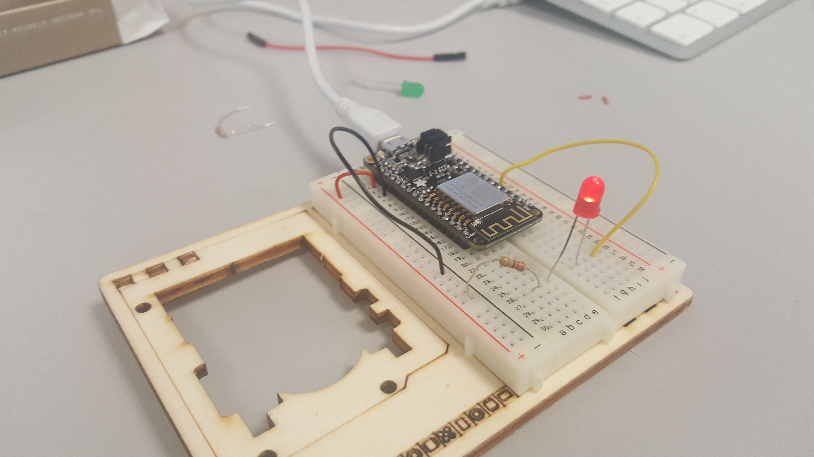
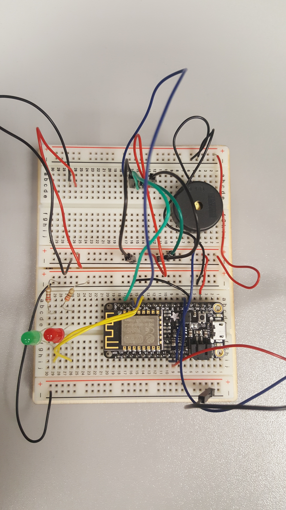

Welcome to the arduinoDetectionGaz wiki!

Installation du circuit électrique :
# 1. Spécifications de capteur de gaz analogique - MQ2 
MQ2 est utilisé dans les équipements de détection de fuite de gaz sur les marchés grand public
et industriel. Ce capteur convient à la détection de GPL, de butane, de propane, de méthane, d'alcool, d'hydrogène, de fumée. 
Il a une sensibilité élevée et un temps de réponse rapide.
Et la sensibilité peut être ajustée par le potentiomètre.

Il a besoin d'alimentation: 5V
Son type d'interface: analogique
Large portée de détection
Réponse rapide et sensibilité élevée
Circuit d'entraînement simple
Vie stable et longue
Taille: 36.4x26.6mm

# 2. Tutorial de connexion MQ2 avec la carte Arduino /la carte WIFI Feather Huzzah ESP8266
Pour construire le circuit on a utilisé :  
* Le diagram de connexion 

* Le pinnage/Pinouts/ de carte WIFI Feather Huzzah ESP8266

* La 1-ère étape : 
  Installer  la carte WIFI Feather Huzzah ESP8266 et l'en brancher sur "Breadboard" avec la diode rouge qui signale la connexion etablié 

   Les details de "pinnage" :

   Diode rouge -> alert sur le pin 13 value de result >=1000 
   Diode vert  ->12   value de result < 1000 

* La 2-ème étape : 
  La connection de gaz sensor

  noir  -> pin GND  ;
  rouge -> pin power - VBUS;
  blue  -> pin analogue ADC /IDE; 
  
  
* La 3-ème étape : 
  La connection de buzz
 
   Blue -> pin 14 IDE
   Noir -> pin GND
    
* La 4-ème étape : 
   La possibilité de la connection d'un écran LCD
   Pinage (1, 3,13,15, 0, 16)  
  

* L'effet final :

